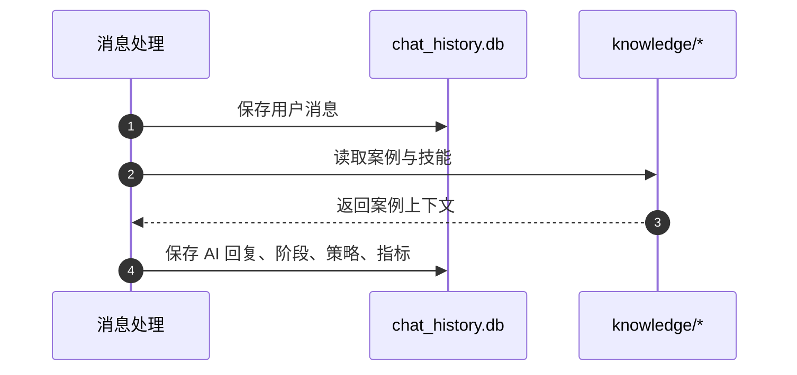

# DATABASE

## 1. 存储总览

这个项目有两类长期存储：

1. `SQLite`：保存运行期业务数据
2. `knowledge/` 文件：保存案例与检索缓存

## 2. SQLite

数据库路径：`data/chat_history.db`

初始化代码：`storage/database.py`

### 2.1 messages

用途：保存对话消息与部分附加元数据。

| 字段 | 类型 | 说明 |
| --- | --- | --- |
| `id` | INTEGER PK | 自增主键 |
| `thread_id` | TEXT | 对话线程 ID |
| `role` | TEXT | 消息角色，如 `user` / `assistant` |
| `content` | TEXT | 消息正文 |
| `emotion` | TEXT | 情绪分析结果，当前以字符串形式存储 |
| `strategy` | TEXT | 回复策略摘要 |
| `stage` | TEXT | 当时所处阶段 |
| `timestamp` | DATETIME | 默认当前时间 |

索引：

- `idx_thread_id`
- `idx_timestamp`

### 2.2 threads

用途：保存线程级会话元信息。

| 字段 | 类型 | 说明 |
| --- | --- | --- |
| `thread_id` | TEXT PK | 对话线程 ID |
| `user_id` | TEXT | 买家 ID |
| `item_id` | TEXT | 商品 ID |
| `bargain_count` | INTEGER | 议价次数 |
| `is_handover` | INTEGER | 是否转人工 |
| `handover_time` | DATETIME | 转人工时间 |
| `start_time` | DATETIME | 会话开始时间 |
| `end_time` | DATETIME | 会话结束时间 |
| `total_rounds` | INTEGER | 对话轮次 |
| `stage_reached` | TEXT | 达到的阶段 |
| `is_deal` | INTEGER | 是否成交 |
| `deal_price` | REAL | 成交价格 |

### 2.3 items

用途：缓存商品信息。

| 字段 | 类型 | 说明 |
| --- | --- | --- |
| `item_id` | TEXT PK | 商品 ID |
| `data` | TEXT | 商品 JSON 文本 |
| `last_updated` | DATETIME | 最后更新时间 |

### 2.4 call_metrics

用途：保存模型调用与工具使用指标。

| 字段 | 类型 | 说明 |
| --- | --- | --- |
| `id` | INTEGER PK | 自增主键 |
| `timestamp` | TEXT | 调用时间 |
| `thread_id` | TEXT | 所属线程 |
| `stage` | TEXT | 调用发生阶段 |
| `input_tokens` | INTEGER | 输入 token |
| `output_tokens` | INTEGER | 输出 token |
| `total_tokens` | INTEGER | 总 token |
| `latency_ms` | REAL | 延迟 |
| `success` | INTEGER | 是否成功 |
| `error` | TEXT | 错误信息 |
| `tools_called` | TEXT | 工具调用列表 JSON |

索引：

- `idx_metrics_timestamp`

## 3. knowledge/ 文件

### 3.1 cases.json

用途：案例库主数据。

当前单条案例常见字段：

| 字段 | 说明 |
| --- | --- |
| `id` | 案例 ID |
| `title` | 案例标题 |
| `description` | 长描述 |
| `tags` | 标签数组 |
| `price` | 参考价格 |
| `duration` | 参考工期 |
| `complexity` | 复杂度 |

说明：

- 当前代码实际依赖 `title`、`description`、`tags`
- `price`、`duration`、`complexity` 主要服务回复与参考说明

### 3.2 skills.json

用途：把能力标签拼入系统上下文，帮助模型生成更贴合“能做什么”的回复。

### 3.3 .faiss_index

用途：`cases.json` 的向量索引缓存。

注意：

- 这是派生文件，不是源数据
- 删除后可由代码重新构建

### 3.4 .embeddings_cache.pkl

用途：embedding 结果缓存，减少重复向量化调用。

## 4. 数据流边界

## 5. 当前约束

- 没有独立 migration 机制，表结构靠启动时 `CREATE TABLE IF NOT EXISTS`
- `messages.emotion`、`messages.strategy`、`call_metrics.tools_called` 目前是文本存储，不利于复杂查询
- `knowledge/` 是文件型知识库，更新后需要考虑索引缓存同步

## 6. 变更原则

只有下面两类变化需要改本文：

1. 表结构或关键字段变化
2. 存储位置、缓存机制、索引文件机制变化

需求细节、临时方案、验证过程不写在这里。
