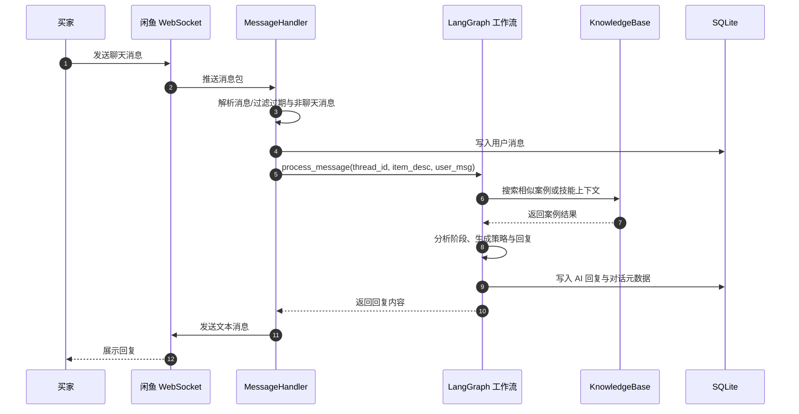

# SPEC-current

## 1. 目标与边界

### 目标

- 自动接待闲鱼买家
- 在多轮对话中收集需求并推进售前流程
- 利用案例库辅助回复和定价参考
- 保存会话、议价和成交相关数据，便于复盘

### 非目标

- 不是通用客服平台
- 不是多租户 SaaS
- 不是稳定生产级高并发系统
- 不是完整 CRM 或订单系统

## 2. 当前系统形态

这是一个单进程 Python 应用，核心由 4 层组成：

| 层 | 当前实现 | 责任 |
| --- | --- | --- |
| 入口层 | `main.py`、`local_chat.py` | 生产连接闲鱼 / 本地调试 |
| 接入层 | `core/websocket_client.py`、`core/message_handler.py` | WebSocket 连接、消息解析、ACK、发送回复 |
| 决策层 | `agent/graph.py`、`agent/tools.py`、`agent/knowledge.py` | LangGraph 状态机、策略生成、案例检索 |
| 存储层 | `storage/database.py`、`knowledge/*` | 会话持久化、案例数据、索引缓存 |

## 3. 当前核心流程

## 4. 对话状态真相

当前状态机阶段定义在 `agent/graph.py`：

- `GREETING`
- `REQUIREMENT`
- `PRICING`
- `NEGOTIATION`
- `CLOSING`
- `COMPLETED`

系统通过最近消息历史和当前消息，抽取：

- 当前阶段
- 项目类型与需求细节
- 用户期望价格与工期
- 已报价格与底价
- 是否进入议价或成交阶段

## 5. 当前案例检索真相

当前代码里的案例检索仍然是 `FAISS 优先 + 关键词降级`，不是新的双通道混合召回实现。

`agent/knowledge.py` 当前行为：

1. 读取 `knowledge/cases.json` 与 `knowledge/skills.json`
2. 若可用，加载或构建 `knowledge/.faiss_index`
3. 查询时优先做 embedding + FAISS 搜索
4. 如果向量不可用或检索失败，则退回关键词匹配

这意味着：

- 当前系统已经有“案例增强回复”
- 但尚未落成此前讨论过的 `tag 过滤 + 向量检索 + BGE rerank` 新方案

后续演进用 Issue 管，不在本文展开。

## 6. 当前持久化真相

### SQLite

主库路径：`data/chat_history.db`

当前承载：

- 消息历史
- 对话线程元数据
- 商品信息缓存
- 模型调用指标

### 知识文件

位于 `knowledge/`：

- `cases.json`：案例数据
- `skills.json`：技能数据
- `.faiss_index`：案例向量索引缓存
- `.embeddings_cache.pkl`：embedding 缓存

## 7. 当前外部依赖

| 依赖 | 用途 | 是否必需 |
| --- | --- | --- |
| 兼容 OpenAI 的聊天模型接口 | 生成回复、分析阶段 | 是 |
| 兼容 OpenAI 的 embedding 接口 | FAISS 检索向量化 | 否，失效时降级关键词 |
| 闲鱼 Cookie | 建立真实 WebSocket 会话 | 生产必需 |
| 飞书 Webhook | 成交通知 / 人工接管通知 | 否 |

## 8. 当前关键约束

- 单进程 + SQLite，天然不适合高并发横向扩展
- LangGraph checkpoint 与业务 SQLite 同时存在，状态边界需要谨慎维护
- 人工接管同时存在内存态和数据库态
- 案例库当前是“文本案例库”，不是严格结构化案例库

## 9. 文档维护原则

本文只写当前生效真相。

- 新需求：写 GitHub Issue
- 方案讨论：写 GitHub Issue
- 未来路线：写 GitHub Issue
- 只有落地并稳定后，才回写本文
